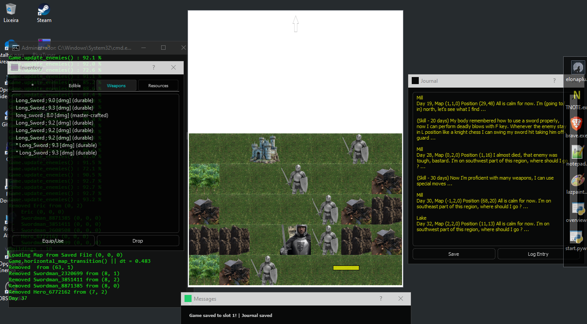

# QtRogueLike 
Python Rogue-Like game using PyQt5.
Python 3.12, maybe works on older versions (not tested).
Use dependencies.bat to install the requirements (PyQt5, noise). Or manually install using pip ( pip install PyQt5, pip install noise ).
Double-click on start.pyw 

Still in development, but I will appreciate if someone help testing the game ;)

